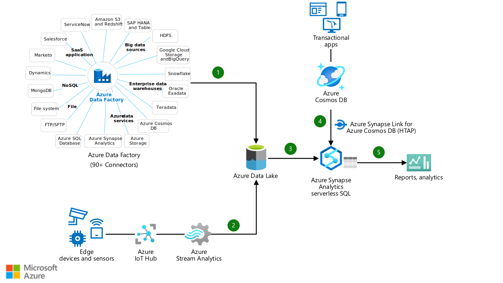
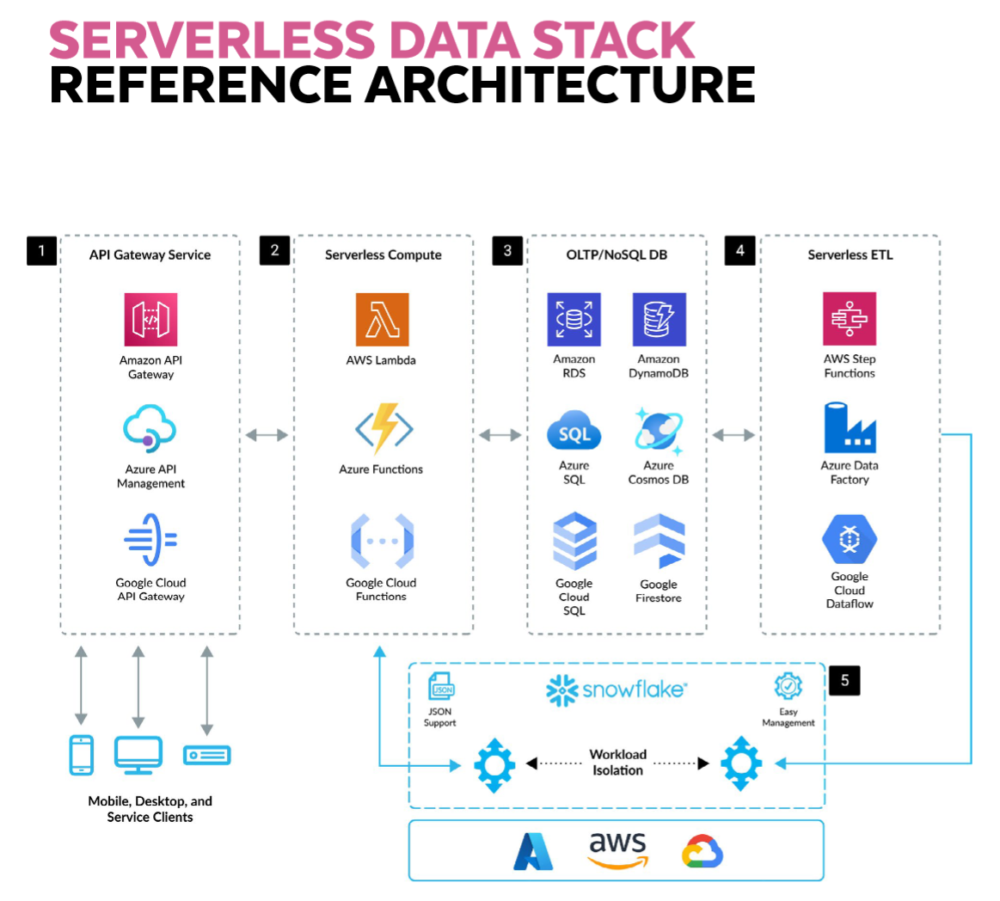
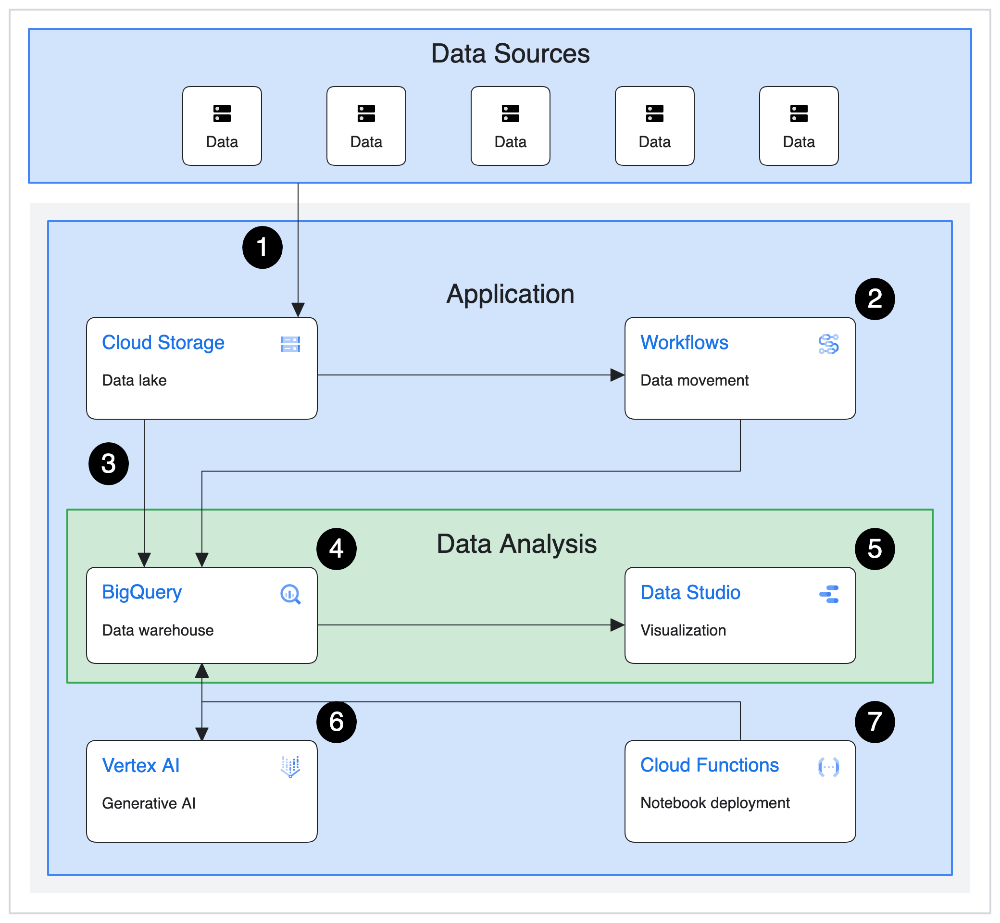

# Big data platformen in 2024

Ik denk dat een van de belangrijkste inputs voor een hedendaags modern dataplatform is hoe erg je uiteindelijke data platform voldoet aan de term big data. Simpelweg dien je voor big data te voldoen aan 1 of meerdere van de 3 V's oftewel Volume, Variëteit of snelheid (Velocity) van data.

Vanuit de tech unicorns en de grote cloud providers wordt er op dit moment hard gepusht op dataplatformen die veelal Spark gebruiken. Dit is logisch als je meerdere grote bronsystemen dient te ontsluiten en hierbij met grote hoeveelheden data te maken hebt die simpelweg niet in memory van 1 machine passen.

Zo zijn er op dit moment een aantal opties om een hedendaags dataplatform in te richten en zie je deze ook veelvulldig terug bij grote Nederlandse bedrijven. Dit is uiteraard een selectie, je ziet ook nog vaak verscheidene on-prem oplossingen voorbij komen en ook wat meer opensource tooling en self hosting als het bedrijf iets meer tech savvy is.

## Azure: ADF + Synapse

## Azure: ADF + Databricks

## Azure: Fabric

## Snowflake

## AWS Modern Data Analytics Reference Architecture

## Google: Data warehouse with BigQuery

## Google: Analytics lakehouse

Al deze moderne oplossingen gaan uit van een lakehouse waarbij data op "goedkope" cloud storage wordt opgeslagen en er vervolgens met losse schaalbare compute tegenaan wordt gewerkt. Met al deze oplossingen kan je gemakkelijk naar tig terabyte (of zelfs petabytes) schalen zonder dat je ook maar iets aan je oplossing (behalve meer compute en meer budget) hoeft te wijzigen.

Bij deze oplossingen zien we de klassieke 3 cloud providers met veelal hun eigen producten en daarnaast ook nog Snowflake en Databricks als de 2 data unicorns die momenteel fel aan het concurreren zijn om de titel van het data bedrijf anno 2024. Deze concurrentie doet de twee bedrijven goed want qua innovatie en gebruiksvriendelijkheid van de 2 data platformen zie je dat ze in de praktijk voorop lopen met hun aanbod.

Het enige nadeel vanuit de optiek van de klant is dat bovenop de kosten voor de cloud VMs die je wilt inzetten er nog extra licentiekosten worden gerekend voor het gebruik van Snowflake/Databricks met tokens die weer afhankelijk van het licentiemodel dat je hebt gekozen andere waardes hebben in euro's.

Verder is het nog interessant om te melden dat de oplossingen van Databricks, Snowflake, AWS en Google al even bestaan waar het productaanbod van Microsoft nog volop in beweging is. Met de introductie van Fabric lijkt Synapse ten dode opgeschreven te zijn maar de realiteit is ook dat Fabric zelf nog niet af genoeg is voor klanten met veeleisende usecases. In Microsoft land kun je dus voorlopig beter de keuze maken om je huidige stack te blijven gebruiken of om op een uitstap te maken naar Databricks op het Azure platform.
